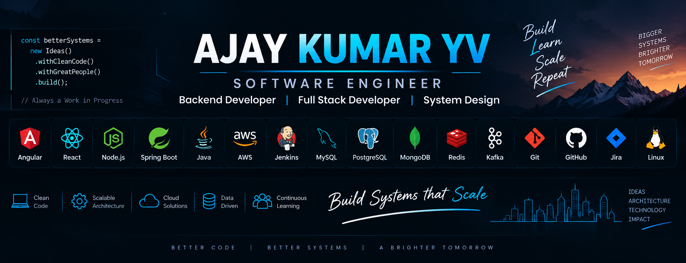

<div align="center">



# Hi 👋, I'm Ajay Kumar YV

### Senior Engineer | Full Stack Developer | Cloud & Data Engineering Enthusiast

<a href="https://github.com/AJAY-KUMAR-YV">
  
</a>
<a href="YOUR_LINKEDIN_URL">
  
</a>

</div>

---

## 👨‍💻 About Me

- 💼 Senior Engineer working on enterprise software and web applications
- 🚀 Full-stack development with frontend and backend integration
- ⚡ Angular, React, Node.js and TypeScript
- ☁️ Building my expertise in AWS and Cloud Engineering
- 📊 Exploring Data Engineering and modern data platforms
- 🏗️ Learning System Design and scalable architecture
- 📚 I enjoy learning new technologies and turning them into practical solutions

---

## 🛠️ Tech Stack

### 💻 Programming Languages

<p>

</p>

### 🎨 Frontend

<p>

</p>

### ⚙️ Backend

<p>

</p>

### ☁️ Cloud & Tools

<p>

</p>

---

## 🚀 What I Work On

<table>
<tr>
<td width="50%">

### 🌐 Full Stack Development

Building responsive web applications, frontend features, backend services and REST API integrations.

</td>
<td width="50%">

### ☁️ Cloud Engineering

Learning and working toward scalable cloud-native solutions using AWS and related technologies.

</td>
</tr>
<tr>
<td width="50%">

### 📊 Data Engineering

Developing skills in Python, SQL, cloud data services, ETL and distributed data processing.

</td>
<td width="50%">

### 🏗️ System Design

Exploring APIs, microservices, scalability, reliability, caching and distributed systems.

</td>
</tr>
</table>

---

## 📌 Featured Projects

### 💳 Open Credits

Full-stack application with frontend and backend components.

**Focus:** React • Node.js • TypeScript • REST APIs • Authentication • Payments • AWS integrations

- [Frontend repository](YOUR_OPEN_CREDITS_FE_REPO)
- [Backend repository](YOUR_OPEN_CREDITS_BE_REPO)

---

## 📊 GitHub

<div align="center">


<br/>


</div>

---

## 🎯 Currently Learning

```text
AWS / Cloud Engineering
        ↓
System Design & Distributed Systems
        ↓
Python & Data Engineering
        ↓
Data Platforms & ETL
        ↓
Scalable Full-Stack Applications
```

---

## 🤝 Let's Connect

<div align="center">

<a href="YOUR_LINKEDIN_URL">

</a>

<a href="https://github.com/AJAY-KUMAR-YV">

</a>

</div>

---

<div align="center">

### 💡 Build • Learn • Improve • Repeat

⭐ Thanks for visiting my profile!

</div>
